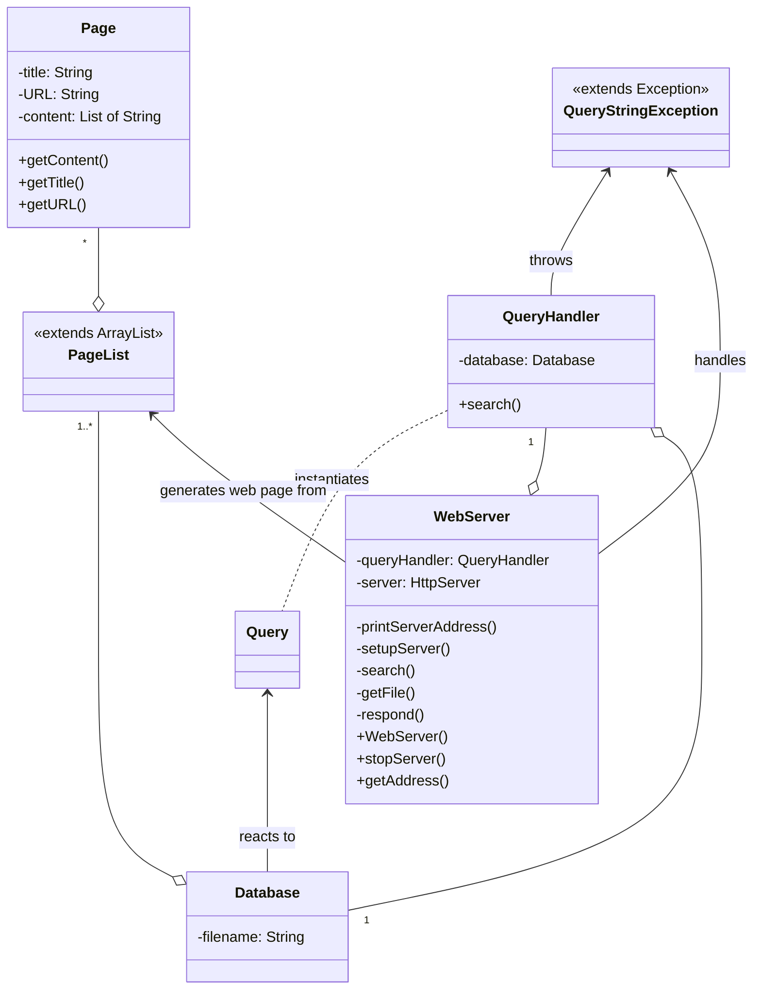

---
title: Intitial Class Diagram
...

This is our initial class diagram

```mermaid
classDiagram   
    
    class QueryHandler{
        -database: Database
        +search()
    }

    class QueryStringException{
        <<extends Exception>>
    }

    class WebServer{
        -queryHandler: QueryHandler
        -server: HttpServer
        -printServerAddress()
        -setupServer()
        -search()
        -getFile()
        -respond()
        +WebServer()
        +stopServer()
        +getAddress()

    }

    class Database{
        -filename: String

    }

    class PageList {
        <<extends ArrayList>>
    }

    class Page{
        -title: String
        -URL: String
        -content: List of String
        +getContent()
        +getTitle()
        +getURL()
    }

    PageList "1..*"--o Database
    QueryHandler .. Query : instantiates
    Page "*" --o PageList
    Query <-- Database : reacts to
    PageList <-- WebServer : generates web page from
    QueryHandler "1"--o WebServer
    Database "1"--o QueryHandler
    QueryStringException <-- QueryHandler : throws
    QueryStringException <-- WebServer : handles


```
It is not very pretty.